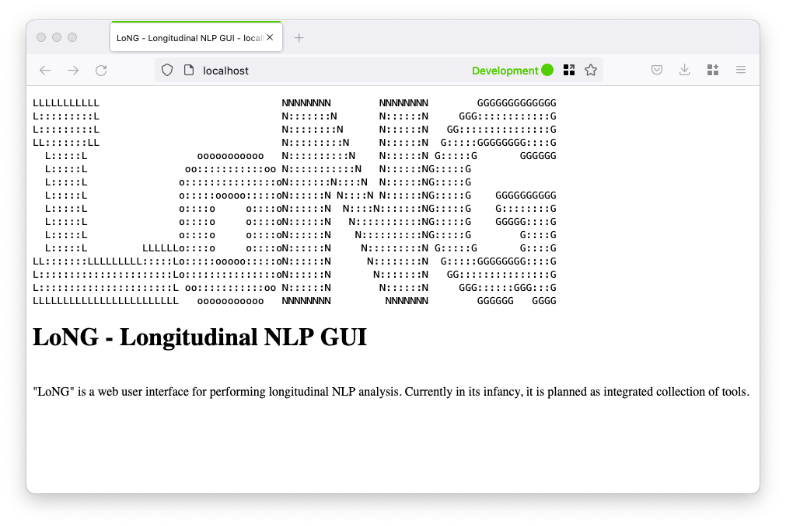

# Getting Started

This assumes that LoNG has already been [installed](installation.md).


## Create a user

Before you can start LoNG, you ***must*** create a password. On Linux/MacOS computers, you will be able to use the `htpasswd` command

```
cd /my/local/clone/long
htpasswd -c ./nginx/config/htpasswd_store admin
```

This creates a username `admin`, You will be asked to enter your choice of password twice. If you run this command again, it will simply overwrite your old password.

If you

## Launching LoNG

Open your shell and navigate to the directory you installed LoNG in. Then run this command:
```
docker compose up
```

Wait until you should see output from both the `long-webserver-1` and `long-dsnb-1` components:


(Ignore the URLs given in the output - these are incorrect. See the [relevant bug](https://github.com/Maria-Liakata-NLP-Group/long/issues/24)).

## Launch the browser

With your preferred browser, goto:
```
http://localhost/
```

If everthing has worked correctly then you should see the placeholder landing page, as below:



## Stopping LoNG

Open your shell and navigate to the directory you installed LoNG in. Then run this command:
```
docker compose down
```
