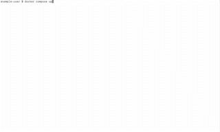

# Getting Started

This assumes that LoNG has already been [installed](installation.md).

# Launching LoNG as a local webapp


```
python src/app.py
```
As the app start you should see various output. Wait until the following has been displayed

```
Dash is running on http://127.0.0.1:8050/

 * Serving Flask app 'webgui.base'
 * Debug mode: on
```

In Google Chrome goto:
```
http://localhost:8050/
```

## Launching LoNG using Docker Compose

Open your shell and navigate to the directory you installed LoNG in. Then run this command:
```
docker compose up
```

Wait until you should see output from both the `long-webserver-1` and `long-dsnb-1` components:



(Ignore the URLs given in the output - these are incorrect. See the [relevant bug](https://github.com/Maria-Liakata-NLP-Group/long/issues/24)).

In Google Chrome goto:
```
http://localhost/
```

If everything has worked correctly then you should see the placeholder landing page, as below:


